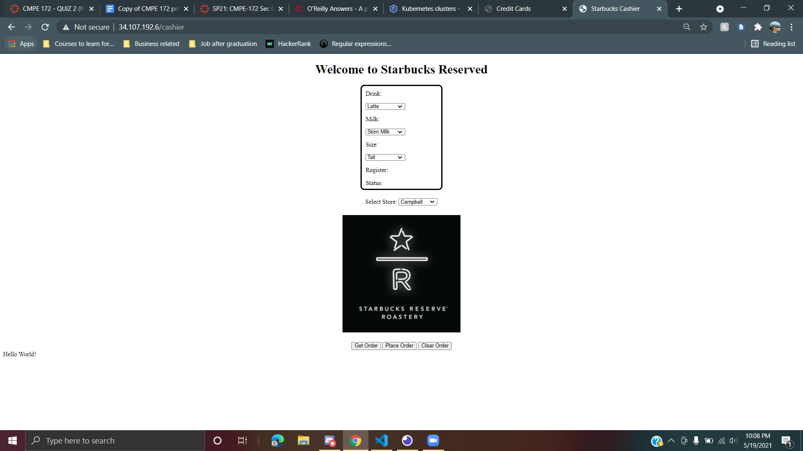

# Starbucks API: Gold Team
Team Members: Bhavanna Mahendraker, Charles Im, Muhammad Umer Sheikh, Vishnu Adda
 
## Team Roles
1) Bhavanna Mahendraker - Backend Developer
2) Charles Im - Lead Backend Developer for Online Store Front
3) Muhammad Umer Sheikh - Lead Frontend Developer for Online Store Front
4) Vishnu Adda - Fullstack Developer for Cashier App
Note: For Online Store Front all of us helped each other. For example, Charles helped Muhammad with adding thymeleaf in his html code while Bhavanna helped modify Lab6, so it fit our project.
## Core Implementation
1. [Introduction](#Introduction)
2. [Cloud Deployment](#Cloud-Deployment)
3. [Cashier's App & Backoffice Help Desk using Spring Security for User Authentication](#Cashier's-App-&-Backoffice-Help-Desk-using-Spring-Security-for-User-Authentication)
4. [Online Store Front](#Online-Store-Front)
5. [Rest API](#Rest-API)
6. [Payment API](#Payment-API)
7. [Closing Thoughts](#Closing-Thoughts)
## Introduction
We were using Agile methodology for our Starbucks API. The client (our assignment requirements) were evolving as we moved closer to the deadline. We conducted weekly Sprints which are part of Agile planning. User stories were also created which explained how users will be interacting with the starbucks API, and what they will require from the development team.
Most of the time, our project constraint on the time. All the developers working on the project are full time students, and taking full university load. We were finding it difficult to juggle our time between various classes. We had to cut down our scope for the project, and work on the essential requirements to maximize the amount of points we can get for the project. The extra components we created for the project can be found under closing thoughts where we discuss the components we created but could not make it work in the short amount of time. For the success of our project we used the project success metric to measure our success. Project success metric is based on cost, performance and schedule. However, we do believe that all the essential requirements mentioned in the grading rubric were met.

## Cloud Deployment
For cloud deployment, we used the lab10 method. To deploy our app:
i. The team loaded a Github repository with the project source code and other additional files such as all the yaml files.  
ii. The team used lab 10 as a template to create the google.yml and gradle.yml for the respective workflows.  
iii. The team made a code release to automate the deployment process to a production environment; that is the kubernetes cluster on google cloud.   
iv. The team created an ingress or load-balancer portion from the service part.   
Click on the link given in ingress   
The web should be running   

#### Cluster

#### Workload

#### Service

#### Ingress

## Cashier's App
For the cashier app, we created a web page (shown below) that the cashier can use to set options for a specific order. These options include dropdowns for: Drinks, Milk, Size, and Store. All the options may be cleared out using the ‘Clear Order’ button. 

Once a customization is selected, the cashier can click on ‘Place Order’ which will be routed via our REST API to POST an order. Once an order is posted, it will be processed by our backend to save the details in our SQL database.

## Online Store Front
For the backend of the storefront, we used Lab 6 as our foundation and reused most of its code. We developed the starbucks register repository and controller java files. Modifications were made in the lab 6 starbucks order and card java files to implement the rewards for users. We also developed User repository and controller java files. 
For the frontend, we were ambitious and wanted our starbucks api to look exactly like the professor showed in the demo and screenshots in the assignment description. None of us felt comfortable working with html, css or javascript. After researching we found out that software like figma and Adobe XD can generate code using web export plugins. This seemed very feasible, but while connecting the frontend with the backend we realized that we made it too complicated for us. Adding thymeleaf got complicated, and the team encountered a great amount of difficulties when implementing the various thymeleaf attributes. The team noticed that the spring web annotation Restcontroller was not compatible with thymeleaf attributes. In order to resolve these issues, we would have to refactor a large amount of our app.

#### Landing

#### Menu

#### Sign Up

#### Gift Cards

## Rest API
The team used Spring Restful web service, most notably the annotation Restcontroller. Using web annotations such as GetMapping and PostMapping, the team was able to route the HTTP respective requests to their mapped destinations.

#### .java

#### Insomnia

## Payment API
Payment Api was created by integrating lab7 into our code. It remains relatively unchanged but maintains its consistency. It successfully activates but it doesn’t link to the backend; therefore, the team could not load money into the giftcards. 
#### Payment form

## Closing Thoughts
While some of the project was not fully realized, the team did learn a great deal about the Spring MVC, Spring Rest, Cybersource and other components. The team more effectively understands that continuous communication is essential and the learning process is not always a straightforward goal.

### Lessons Learned
As a team, we learned to make leadership a collaborative process; a form of leadership that meshes well with the ever changing design processes in an agile environment. For future projects, we could create an ‘Activity Network’ diagram to help us visualize which tasks were flexible, and which ones were high priority. Furthermore, we believed that we should not start implementing from the first day. We should make a Gantt Chart, and assign tasks to each member so we all can be leaders in our own right.
