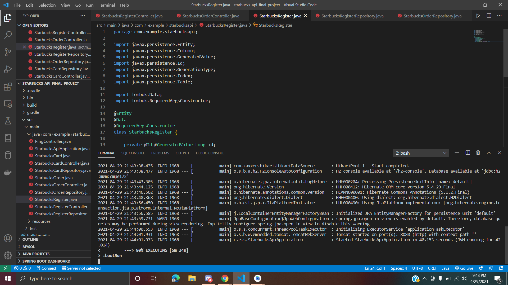

###

# Week 2

Worked with Charles and resolved the problem with StarbucksRegisterRepository and StarbucksRegisterController java files. We have a working Starbucks Registers entity. Below is a screenshot of successful bootRun with the updated java files.

