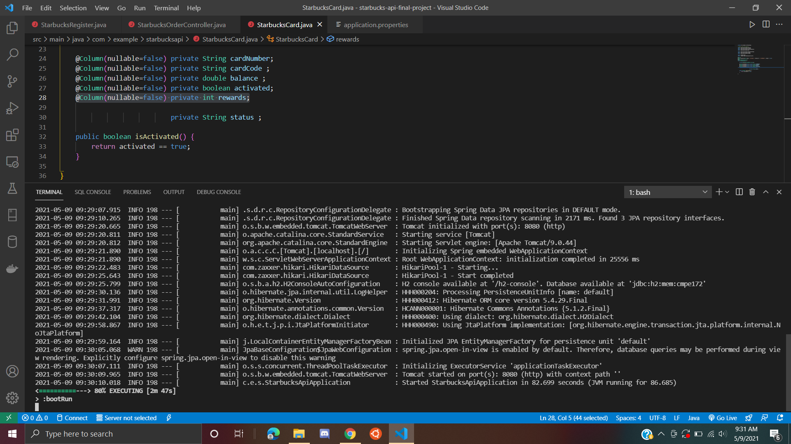

My task was to implement the rewards this week, but I was having an error when I tried to define it in the StarbucksOrder.java file.
With Charles' help, I finished defining the rewards integer value in StarbucksCards.java 
I successfully implemented the rewards calculation in StarbucksOrderRepository.java.

The program was succeffuly running as shown in the picture below

