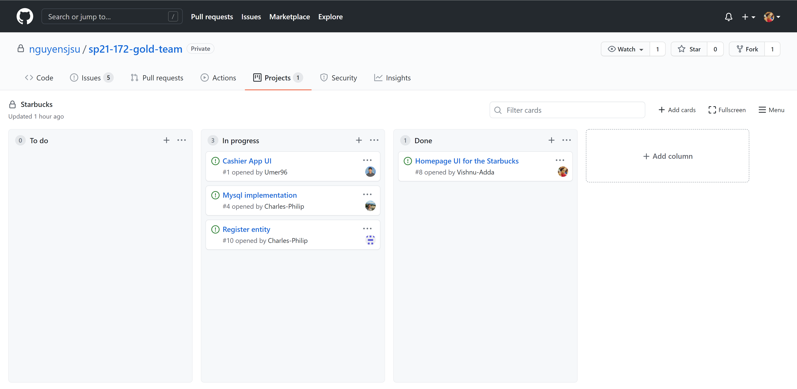
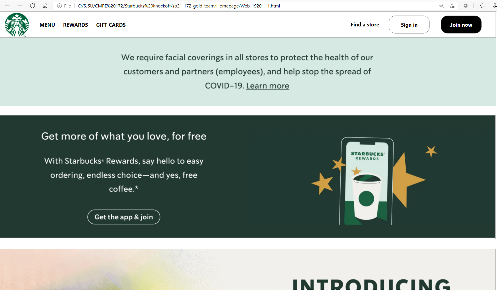

# CMPE 172 Project Journal: Week 1

Week1: I worked on designing the homepage UI for the starbucks website. 
#### Meetings
Last week, we had two meetings in which we assigned ourselves tasks, and let everyone know what we are working on to avoid any confusion.
The meetings were held on: 

1) Friday 4/16 @ 1 pm
2) Thursday 4/22 @ 12 pm
 
#### Challenges
Challenges: The main challenge I encountered was that I did not know HTML. I overcome this challenge by using Adobe XD, and made the UI on it. I then exported Adobe XD file as a html file, and it worked. The html code was generated for me.

My second challenge is to figure out the font and color scheme that is similar to Starbucks UI, so that the UI looks like Starbucks UI.

#### Tasks

The homepage I created for Starbucks homepage is below:

