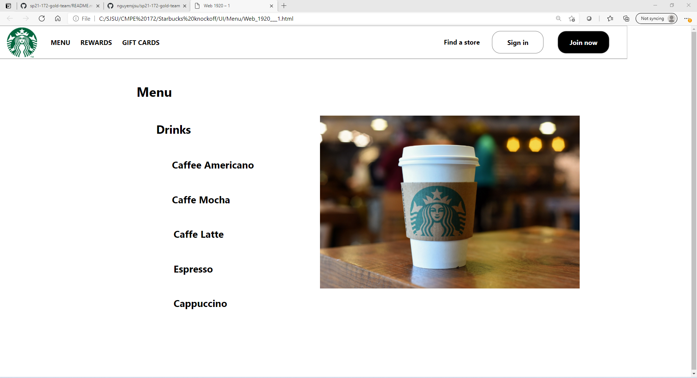
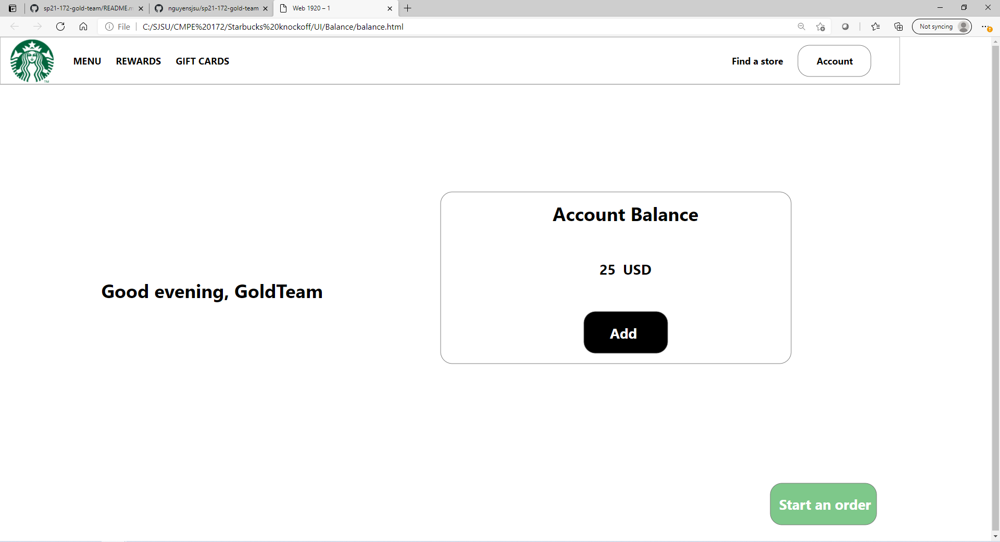
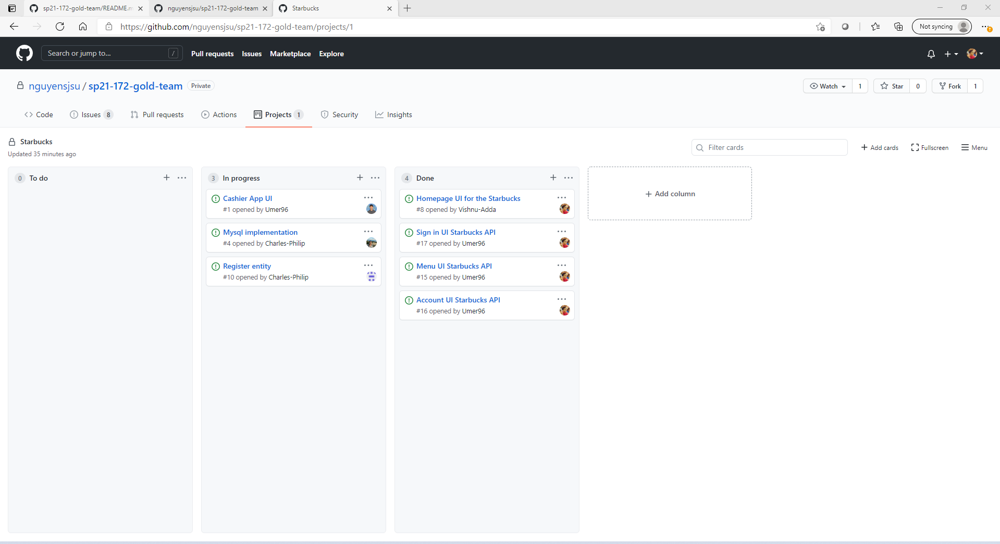

# CMPE 172 Project Journal: Week 2

Week1: I worked on designed 3 components of the UI:
1) Menu : I used the 5 drinks that was mentioned in the starbucksapi lab. My group and I decided to implement only 5 drinks first, and if we have time we can implement snacks such as cookies and pastries. The UI page is shown below:

2) Account balance page: I used the template provided by the professor under the project description. 

3) Sign in: Created a standard sign in page UI with Starbucks scheme. 

#### Meetings
No team meetings were held, but Charles from the database team from Team Gold reached out about a problem he was having with application.properties. We tried generating a new gradle project, and try to compare with the old application.properties. Unfortunately, we were not able to solve the problem.

#### Tasks

