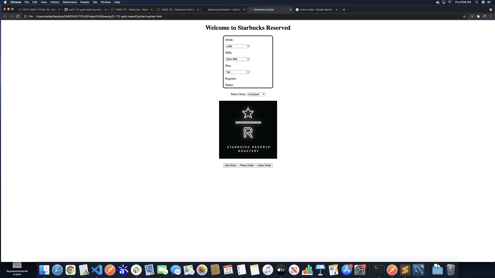

# Vishnu Adda's Project Journal: Week 1

For this week, I mostly decided to try and get us all up to speed and to assign basic tasks for everyone to complete.

I set up the following meetings for our team:
- Friday 4/16 @ 1 pm
- Thursday 4/22 @ 12 pm

## Task
The task delegated to me: Design the Cashier App UI

For this task, I essentially converted the cashier UI from the Canvas assignment into HTML and CSS. This is an open-ended design, as it mostly just creates dropdown menus for some order options and leaves some space for spring fields. I plan on talking with my group to finalize these options before closing the issue.

The below image shows the WIP UI

## Challenges

Honestly it's been a while since the last time I really worked with HTML and CSS code. I actually do have a lot of experience with it, but that was more than a year ago. My primary challenge came from relearning a lot of these concepts, especially CSS.

The primary CSS feature used here is Flexbox which, while a little confusing to learn, can help make nice and adaptive designs.

The other main challenge was something a little bit more team-wide, that being Git. Not everyone in our team was fully experienced with Git, and this made working together a bit of a hassle. I helped to streamline the process for other members, and so hopefully everyone will get used to making PRs.