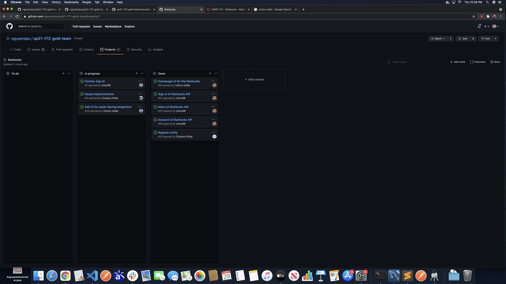
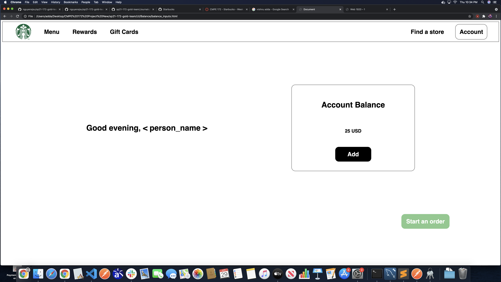
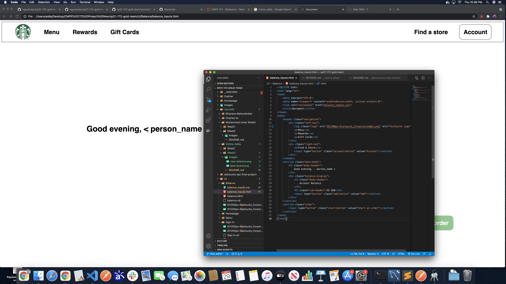

# CMPE 172 Project Journal: Week 2

For this lab, I worked on refactoring the UI for easier Spring implementation (see the task board below)

The edits are based off of the prototype HTML files created by Umer. Although they mostly has to do with refactoring, I did still end up editing some CSS, though these were minor edits. 

Image of new UI for Balance can be seen below:

As mentioned, the edits are mostly from refactoring the HTML. The prototyping tool generated 3000+ lines, so I condensed it to around 40 lines. See below image for the refactor.

The relevant PR has the following ID: 9f0630fccefde5274eea8d63d76359829e8c1b78

The primary challenge came from translating the prototypal code over to a more human readable format. It was pretty grueling, and it took me quite a few hours just for one page. Thankfully the experience has helped me remember some key CSS tricks, so I should be able to accomplish future tasks much faster.

I plan on making more edits to the UI as we continuously add more code. As such, this issue is still a WIP until we're fully satisfied with the UI.