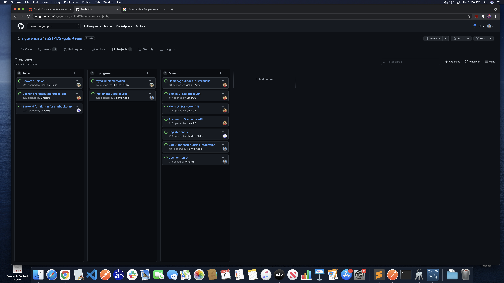
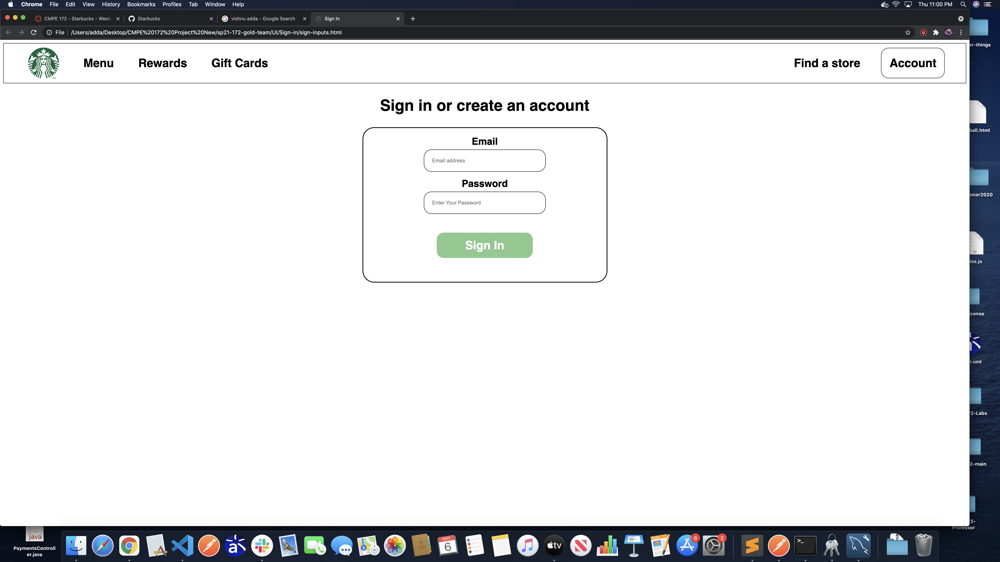

# CMPE 172 Project Journal: Week 3

This week, I finished up refactoring the UI files, and started working on implementing the CyberSource API.

Similar to last week, I finished up the UI that has been implemented for the project. This will allow us to easily add thymeleaf modifiers to the HTML files. Additionally, I created a group CyberSource account that we can interact with for credit card verification.

See this commit: 3a0304cf5910bae163eb6e32a4884f0c6972d1b1

Thankfully I did not have many challenges this week, as I largely was able to reference my previous work from last week. In our next meeting, I plan on discussing how we might be able to all use the same CyberSource company for individual testing purposes. I believe this will likely cause challenges moving forward.