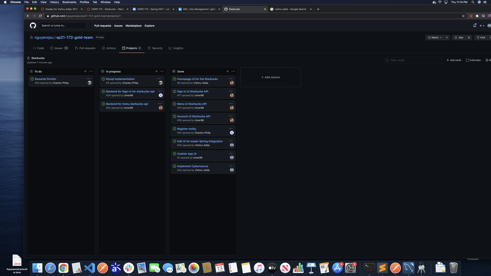
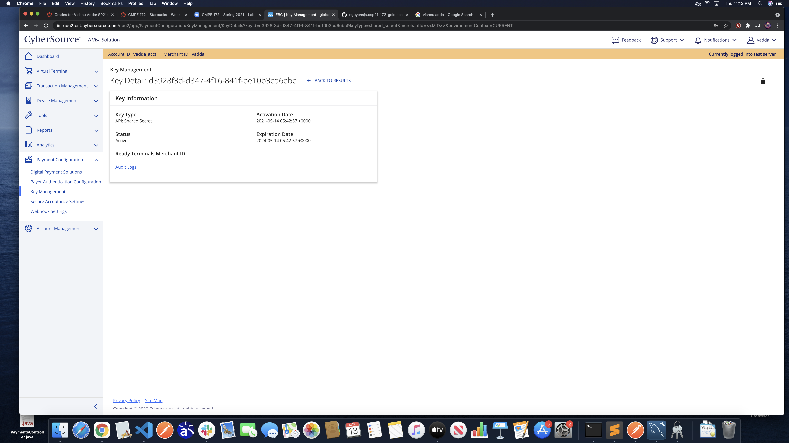

# CMPE 172 Project Journal: Week 4

This week, I made tweaks to the Cybersource API and fitted it to our project.

For this week, I essentially edited the cybersource API from our lab so that we can handle transactions with starbucks. Additionally, I prepared the share key so that we can start using it in test environments for the project. Now that our project has most of the individual components made, we can finally start linking them together.

See the below image for the cybersource key

Although I didn't have many challenges this week, I felt like I didn't have a good enough understanding of the API at first to fit it with our project. After a long process of creating the hash maps for each transaction option and mapping the API functions as needed, it should be good to go.